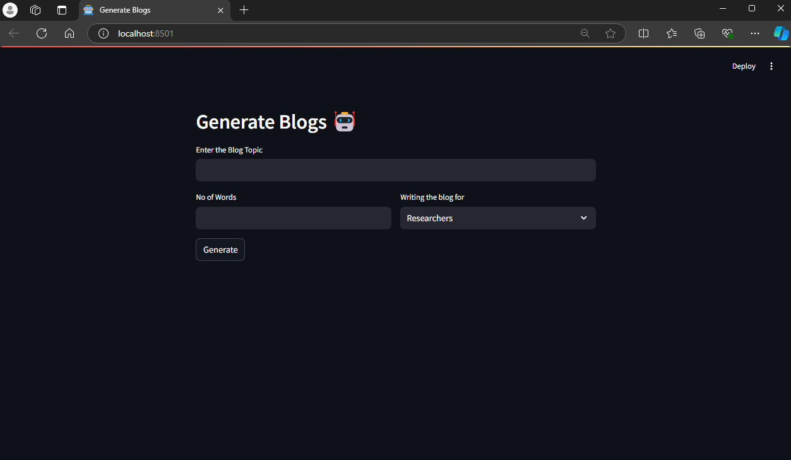

## How to setup a Project
1. Install [uv](https://docs.astral.sh/uv/getting-started/installation/)
2. Type below command
```
uv sync
```
3. Download model from [here](https://huggingface.co/TheBloke/Llama-2-7B-Chat-GGML/tree/main)
4. Run using below command 
```
streamlit run app.py
```

